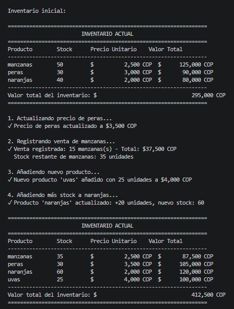
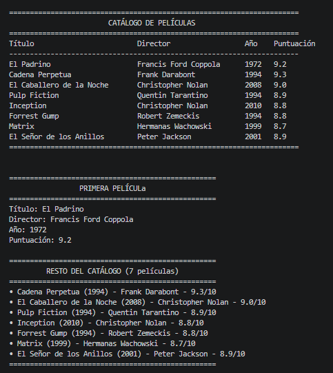
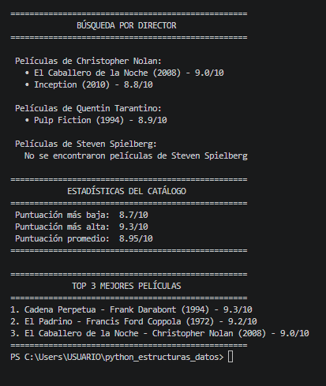
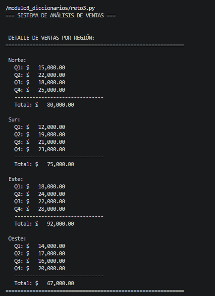
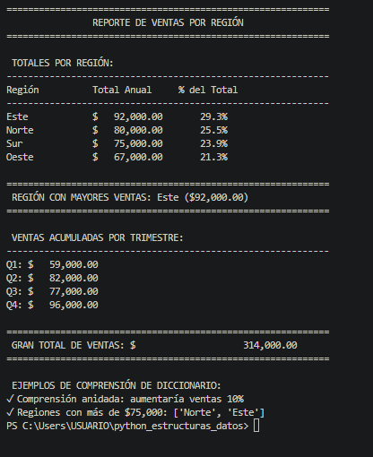

## Reto módulo 1: Sistema de inventario con listas

# Descripción
Este módulo implementa un sistema de gestión de inventario utilizando listas anidadas en Python. Permite administrar productos, precios y stock de manera eficiente, demostrando los conceptos fundamentales de estructuras de datos mutables.

# Conceptos Aplicados
Listas y Estructuras Anidadas

Creación de listas con corchetes []

Listas de sublistas para representar registros

Acceso por índices ([0], [1], [2])

Búsqueda lineal en colecciones

## Salida

Al ejecutar el programa, se muestra el inventario inicial, se realizan las operaciones solicitadas y se presenta el estado final con el siguiente formato:

- Tabla organizada con productos, stock, precios y valor total
- Mensajes claros para cada operación (actualización, venta, adición)
- Cálculo automático del valor total del inventario

## Reto módulo 2: Sistema de Catálogo de Películas con Tuplas

# Descripción
Este módulo implementa un catálogo de películas utilizando tuplas inmutables en Python. El sistema permite gestionar información de películas (título, director, año, puntuación) aplicando conceptos fundamentales de tuplas como desempaquetado, operador * y retorno múltiple.

# Conceptos Aplicados

Tuplas y estructuras anidadas – Creación de tuplas con paréntesis ()

Tuplas de tuplas – Para representar el catálogo completo

Desempaquetado básico – titulo, director, año, punt = pelicula

Operador * – primera, *resto = catalogo

Guion bajo _ – Para ignorar campos no necesarios

Retorno múltiple – Funciones que devuelven (min, max, promedio)

## Salida

Al ejecutar el programa, se muestra el catálogo completo, se realizan búsquedas por director y se presentan estadísticas con el siguiente formato:

- Tabla organizada con título, director, año y puntuación
- Separación visual entre primera película y el resto del catálogo
- Búsqueda insensible a mayúsculas/minúsculas por director
- Cálculo automático de puntuación mínima, máxima y promedio

## Reto módulo 3: Análisis de ventas por región con diccionarios

# Descripción
Este módulo implementa un sistema de análisis de ventas utilizando diccionarios anidados en Python. Permite analizar ventas trimestrales por región, calcular totales, encontrar máximos y generar reportes con porcentajes, demostrando conceptos fundamentales de estructuras clave-valor.

# Conceptos Aplicados
Diccionarios y estructuras anidadas – Creación con llaves {}

Diccionarios de diccionarios – Para representar regiones con trimestres

items(), values(), keys() – Iteración sobre vistas de diccionarios

Dict comprehension – {region: porcentaje for region, monto in totales.items()}

sorted() con key=lambda – Ordenar de mayor a menor

max() con lambda – Encontrar región con mayores ventas

## Salida

Al ejecutar el programa, se muestra el detalle de ventas por región, el reporte completo con totales y porcentajes, y las estadísticas principales con el siguiente formato:

- Tabla organizada con región, total anual y porcentaje del total
- Región con mayores ventas destacada con trofeo
- Ventas acumuladas por trimestre (Q1, Q2, Q3, Q4)
- Reporte ordenado de mayor a menor ventas
- Comprensiones de diccionario para transformaciones rápidas