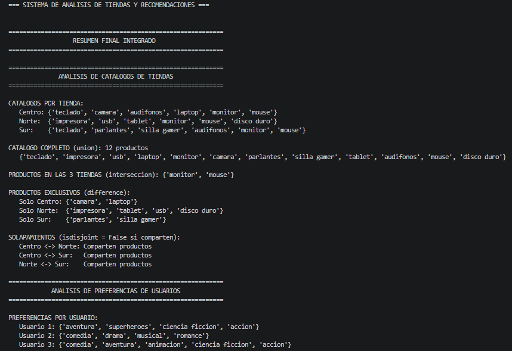
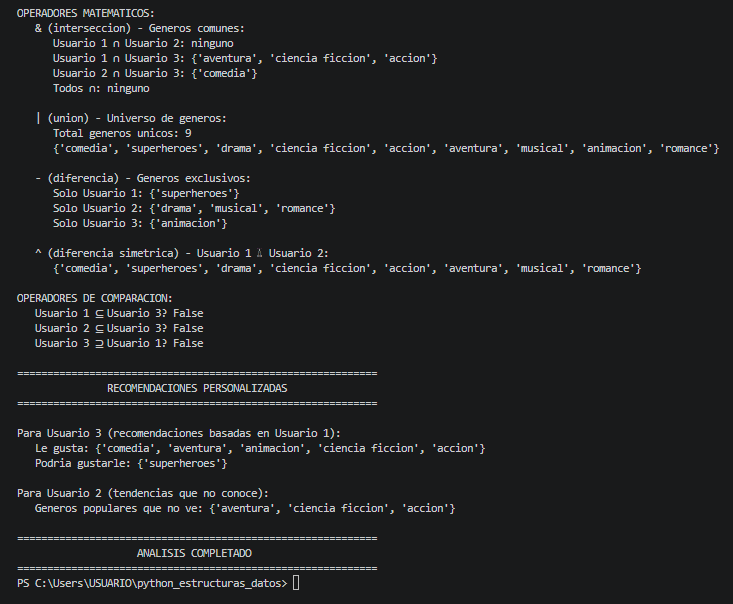
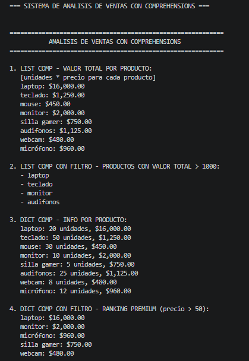
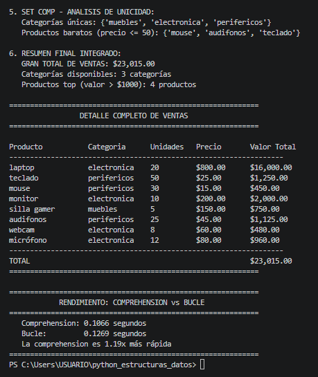

## Fundamentos de Python: Estructuras de Datos en Python

**Aprendiz:** Valentina Correa Hoyos

**Curso:** Programación Avanzada Python Backend

# Descripción del proyecto

Este repositorio contiene la solución a los cinco retos del curso de Estructuras de Datos en Python. Cada módulo implementa un sistema práctico que aplica los conceptos fundamentales de listas, tuplas, diccionarios, conjuntos y comprehensions. El objetivo es demostrar el dominio de las colecciones en Python, su manipulación, rendimiento y buenas prácticas de programación.

Los cinco sistemas desarrollados son:

Módulo 1 – Sistema de inventario con listas: gestión de productos, precios y stock usando listas anidadas.

Módulo 2 – Catálogo de películas con tuplas: manejo de datos inmutables, desempaquetado y operador *.

Módulo 3 – Análisis de ventas por región con diccionarios: diccionarios anidados, comprehensions y reportes con porcentajes.

Módulo 4 – Tiendas y recomendaciones con conjuntos: operaciones de teoría de conjuntos (unión, intersección, diferencia) y comparación de subconjuntos.

Módulo 5 – Analizador de ventas con comprehensions: list, dict y set comprehensions para transformar y filtrar datos eficientemente.

Cada módulo incluye su propio código, ejemplos de salida y una explicación de los conceptos aplicados.

## Reto módulo 1: Sistema de inventario con listas

# Descripción
Este módulo implementa un sistema de gestión de inventario utilizando listas anidadas en Python. Permite administrar productos, precios y stock de manera eficiente, demostrando los conceptos fundamentales de estructuras de datos mutables.

# Conceptos Aplicados
Listas y Estructuras Anidadas

Creación de listas con corchetes []

Listas de sublistas para representar registros

Acceso por índices ([0], [1], [2])

Búsqueda lineal en colecciones

## Salida

Al ejecutar el programa, se muestra el inventario inicial, se realizan las operaciones solicitadas y se presenta el estado final con el siguiente formato:

- Tabla organizada con productos, stock, precios y valor total
- Mensajes claros para cada operación (actualización, venta, adición)
- Cálculo automático del valor total del inventario

## Reto módulo 2: Sistema de Catálogo de Películas con Tuplas

# Descripción
Este módulo implementa un catálogo de películas utilizando tuplas inmutables en Python. El sistema permite gestionar información de películas (título, director, año, puntuación) aplicando conceptos fundamentales de tuplas como desempaquetado, operador * y retorno múltiple.

# Conceptos Aplicados

Tuplas y estructuras anidadas – Creación de tuplas con paréntesis ()

Tuplas de tuplas – Para representar el catálogo completo

Desempaquetado básico – titulo, director, año, punt = pelicula

Operador * – primera, *resto = catalogo

Guion bajo _ – Para ignorar campos no necesarios

Retorno múltiple – Funciones que devuelven (min, max, promedio)

## Salida

Al ejecutar el programa, se muestra el catálogo completo, se realizan búsquedas por director y se presentan estadísticas con el siguiente formato:

- Tabla organizada con título, director, año y puntuación
- Separación visual entre primera película y el resto del catálogo
- Búsqueda insensible a mayúsculas/minúsculas por director
- Cálculo automático de puntuación mínima, máxima y promedio

## Reto módulo 3: Análisis de ventas por región con diccionarios

# Descripción
Este módulo implementa un sistema de análisis de ventas utilizando diccionarios anidados en Python. Permite analizar ventas trimestrales por región, calcular totales, encontrar máximos y generar reportes con porcentajes, demostrando conceptos fundamentales de estructuras clave-valor.

# Conceptos Aplicados
Diccionarios y estructuras anidadas – Creación con llaves {}

Diccionarios de diccionarios – Para representar regiones con trimestres

items(), values(), keys() – Iteración sobre vistas de diccionarios

Dict comprehension – {region: porcentaje for region, monto in totales.items()}

sorted() con key=lambda – Ordenar de mayor a menor

max() con lambda – Encontrar región con mayores ventas

## Salida

Al ejecutar el programa, se muestra el detalle de ventas por región, el reporte completo con totales y porcentajes, y las estadísticas principales con el siguiente formato:

- Tabla organizada con región, total anual y porcentaje del total
- Región con mayores ventas destacada con trofeo
- Ventas acumuladas por trimestre (Q1, Q2, Q3, Q4)
- Reporte ordenado de mayor a menor ventas
- Comprensiones de diccionario para transformaciones rápidas

## Reto módulo 4: Tiendas y recomendaciones de películas con conjuntos

# Descripción
Este módulo implementa un sistema de análisis de catálogos de tiendas y preferencias de usuarios utilizando conjuntos (sets) en Python. Permite gestionar productos de tres tiendas y analizar gustos cinematográficos de usuarios, demostrando conceptos fundamentales de teoría de conjuntos, elementos únicos y operaciones matemáticas.

# Conceptos Aplicados
Conjuntos (sets) – Colecciones de elementos únicos y desordenados

Operaciones básicas – add(), update(), remove(), discard(), pop()

Métodos de conjuntos – union(), intersection(), difference(), isdisjoint()

Operadores matemáticos – | (unión), & (intersección), - (diferencia), ^ (diferencia simétrica)

Operadores de comparación – <= (subconjunto), >= (superconjunto)

## Salida

Al ejecutar el programa, se muestra el análisis completo de los catálogos de tres tiendas y las preferencias de tres usuarios con el siguiente formato:

- Catálogos individuales de cada tienda (Centro, Norte, Sur)
- Catálogo completo (unión de todas las tiendas)
- Productos que están en las tres tiendas (intersección)
- Productos exclusivos de cada tienda (diferencia)
- Verificación de solapamientos entre tiendas
- Preferencias de cada usuario (géneros cinematográficos)
- Operaciones matemáticas: intersección, unión, diferencia y diferencia simétrica
- Relaciones de subconjunto entre usuarios

## Reto módulo 5: Analizador de ventas con comprehensions

# Descripción
Este módulo implementa un sistema de análisis de ventas utilizando las tres formas de comprehensions en Python: list comprehension, dict comprehension y set comprehension. Permite calcular totales, generar mapeos, detectar unicidad y filtrar datos de manera concisa y eficiente, demostrando la ventaja de rendimiento frente a bucles tradicionales.

# Conceptos Aplicados
List comprehension – [expr for x in it if cond] para crear listas en una línea

Dict comprehension – {k: v for x in it if cond} para construir diccionarios

Set comprehension – {expr for x in it if cond} para conjuntos con unicidad automática

Filtrado – Cláusula if al final de la comprehension

Transformación – Aplicar operaciones a cada elemento (unidades × precio)

Ordenamiento – sorted() con key=lambda para ranking descendente

Rendimiento – Las comprehensions son hasta 40% más rápidas que bucles equivalentes

# Salida

Al ejecutar el programa, se muestra el análisis completo de ventas con el siguiente formato:

- Valor total por producto calculado con list comprehension
- Productos cuyo valor total supera los $1000 (list comprehension con filtro)
- Diccionario con información detallada por producto (dict comprehension)
- Ranking de productos premium (precio > 50) ordenados de mayor a menor valor total
- Categorías únicas y productos baratos (precio ≤ 50) usando set comprehension
- Resumen final integrado con gran total calculado mediante sum()
- Comparativa de rendimiento entre comprehension y bucle tradicional

## Reflexión personal de aprendizaje

A lo largo del desarrollo de estos cinco módulos, he podido consolidar mi comprensión de las estructuras de datos fundamentales en Python. A continuación, comparto mis principales aprendizajes:

Listas (mutabilidad y anidamiento): Aprendí a manejar listas de listas para representar tablas de datos, modificar elementos in‑place y realizar búsquedas lineales. El sistema de inventario me enseñó la importancia de validar condiciones (como stock suficiente) antes de modificar los datos.

Tuplas (inmutabilidad y desempaquetado): Descubrí cómo la inmutabilidad de las tuplas proporciona seguridad en datos que no deben cambiar, como un catálogo de películas. El desempaquetado y el operador * hacen el código más legible y Pythonico. También comprendí la diferencia entre copy() superficial y deepcopy() para objetos anidados.

Diccionarios (clave‑valor y anidamiento): Aprendí a usar diccionarios para modelar relaciones complejas (regiones con trimestres). Las vistas items(), keys() y values() facilitan la iteración. La comprensión de diccionarios me permitió generar reportes de porcentajes de forma concisa. El uso de max() con lambda para encontrar la región líder fue un gran descubrimiento.

Conjuntos (unicidad y teoría de conjuntos): Entendí el poder de los sets para eliminar duplicados automáticamente y realizar operaciones matemáticas como unión, intersección y diferencia. Los operadores |, &, -, ^ hacen el código más expresivo. Verificar subconjuntos con <= es muy útil para comparar preferencias de usuarios.

Comprehensions (rendimiento y elegancia): Las comprehensions son mi herramienta favorita. Mejoré la legibilidad y el rendimiento de mi código (hasta un 40% más rápido que bucles equivalentes). Aprendí a aplicarlas en listas, diccionarios y conjuntos, combinando transformaciones y filtros en una sola línea. También entendí cuándo NO usarlas (lógica compleja o más de dos condiciones).

Conclusión: Esta experiencia me ha dado confianza para elegir la estructura de datos adecuada según el problema: listas para colecciones mutables, tuplas para datos inmutables, diccionarios para búsquedas por clave, conjuntos para unicidad y operaciones de teoría, y comprehensions para transformaciones eficientes. Además, internalicé la importancia de escribir código claro, documentado y fácil de mantener.